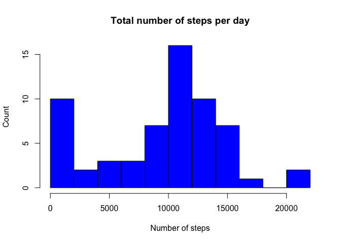
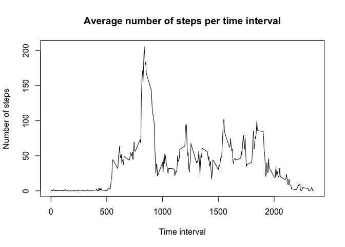
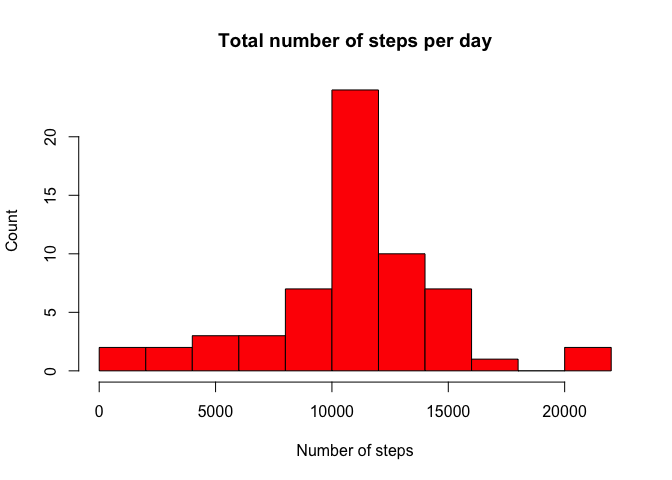
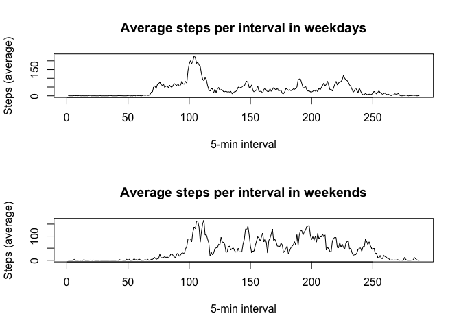

# Reproducible Research: Peer Assessment 1

##Loading and preprocessing the data
First of all, the following R code loads the CSV table to have it as a dataset. It is assumed that the file 'activity.zip' is downloaded and extracted.

The dates are also parsed in the format specified as YYYY-MM-DD, because we will need it later.


```r
#Reads data from csv file
data<- read.csv("activity.csv")

#Parses the dates in a suitable format
data$date <- as.Date(data$date,"%Y-%m-%d")
```

##What is mean total number of steps taken per day?

###Create the histogram

First of all, we create the histogram, by calculating the totals of steps taken each day. I have decided to make 10 breaks, so that it can be visually correct.


```r
#Generates the totals of the number of steps per day
datelevels<- factor(data$date)
addsteps<-tapply(data$steps,datelevels,FUN=sum, na.rm=TRUE)

#Creates the histogram
hist(addsteps,col=4,freq=TRUE,main="Total number of steps per day", xlab = "Number of steps", ylab="Count", breaks=10)
```

 

###Calculate the mean and the median

In the next code chunk we calculate the median and mean of the data previously drawn.


```r
#Calculates the mean of steps per day
mean(addsteps)
```

```
## [1] 9354.23
```

```r
#Calculates the median of steps per day
median(addsteps)
```

```
## [1] 10395
```

##What is the average daily activity pattern?

##Plotting the time series

In this section we calculate the averages of steps taken in each 5 minutes interval. First, we have to make a table with the averages for each time interval. Then, we create a plot comparing these two variables.


```r
#Generates the totals of steps per time interval
meansteps<-aggregate(steps~interval, data,FUN=mean)

#Plots the graph
plot(meansteps,type="l",main="Average number of steps per time interval",
     xlab="Time interval", ylab="Number of steps")
```

 

###Getting the maximum value

Now we find the interval that has de maximum number of steps, with the data we had before.


```r
#Calculates the interval with the maximum of steps
maximum<-which.max(meansteps$steps)
meansteps[maximum,]
```

```
##     interval    steps
## 104      835 206.1698
```

##Inputing missing values

In our data we have lots of data with an NA value. Till now, we have considered this data, but now it must be treated so that every row has a value.

###Number of missing values

First, we calculate how many NA we have in the data. When it is done, we are going to replace the each NA value by the average in that 5 minute interval.


```r
#Counts the number of NA cases
dataNA<-!complete.cases(data)
sum(dataNA)
```

```
## [1] 2304
```

###Replacing the missing values

Now, the NA values are replaced by those averages calculated before to make the previous plot.


```r
#Replaces the NA by the averages for 5-min time interval
for (i in 1:nrow(data)){
        if (is.na(data$steps[i])){
                intervalue <- data$interval[i]
                rowint<-which(meansteps$interval==intervalue)
                data$steps[i]<-meansteps$steps[rowint]
        }
}
```

###Creating the new histogram

Now, in order to create the new histogram, we have to make the same as before, but with the new data. Once it is done, we can draw the histogram again.


```r
#Makes the histogram again
datelevels2<- factor(data$date)
addsteps2<-tapply(data$steps,datelevels2,FUN=sum,na.rm=TRUE)

#Creates the histogram
hist(addsteps2,col=2,freq=TRUE,main="Total number of steps per day", 
     xlab = "Number of steps", ylab="Count", breaks=10)
```

 

As we can see, this new histogram is different from the first one. That happens because the NA values were trated as 0s.

###Calculating mean and median with the new data

The same will happen with the mean and median. As the NAs do not exist any more, the 0s do not have effect in the results and the mean and median increase slightly.


```r
#Calculates the mean of steps per day
mean(addsteps2,na.rm=TRUE)
```

```
## [1] 10766.19
```

```r
#Calculates the median of steps per day
median(addsteps2,na.rm=TRUE)
```

```
## [1] 10766.19
```

##Are there differences in activity patterns between weekdays and weekends?

Now we are going to see if the patterns between weekdays and weekends are different. In order to do that, we are going to do the following:

1. Create a new column named 'day' and another column named 'weekend'. The first one will determine which day of the week is. The second one will determine whether it is a weekday or not. To do that, we are going to use the function weekdays().


```r
#Function to determine if its a weekday or weekend
weekend <- function (day) {
        if (day == "Saturday" || day=="Sunday") {
                return("weekend")
        }
        else return("weekday")
}

#Sets the columns day and weekend
data$dayweek<-weekdays(data$date)
for (i in 1:nrow(data)){
        data$weekend[i] <- weekend(data$dayweek[i])
}

averageweekday = tapply(subset(data, weekend == "weekday")$steps,subset(data, weekend == "weekday")$interval,mean, na.rm = TRUE)

averageweekend = tapply(subset(data, weekend == "weekend")$steps, subset(data, weekend == "weekend")$interval, mean, na.rm = TRUE)
```

2. Once we have the columns created, we create two plots, depending on the the type of day.


```r
par(mfrow = c(2, 1))
plot(averageweekday, type = "l", xlab = "5-min interval", ylab = "Steps (average)", main = "Average steps per interval in weekdays")
plot(averageweekend, type = "l", xlab = "5-min interval", ylab = "Steps (average)", main = "Average steps per interval in weekends")
```

 
